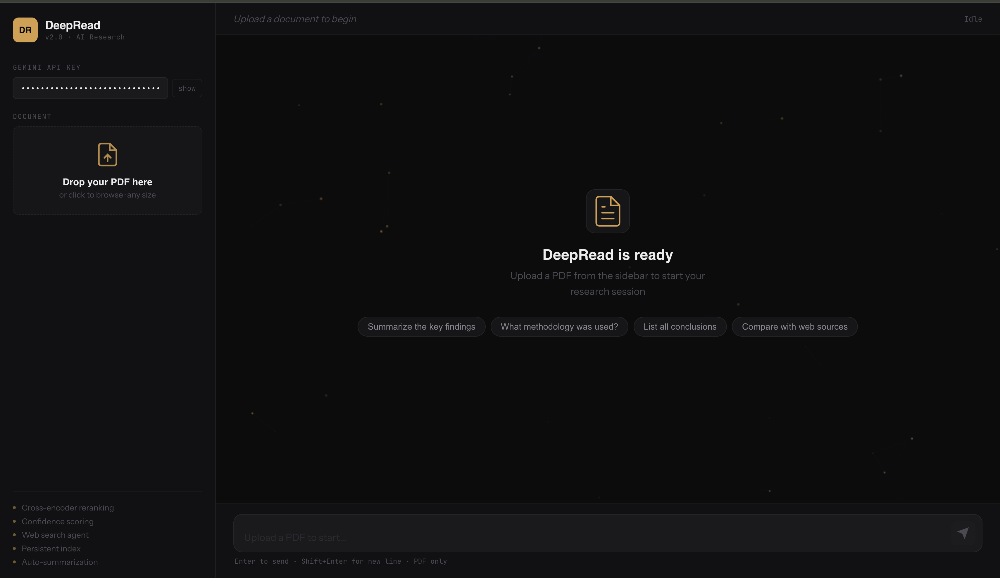
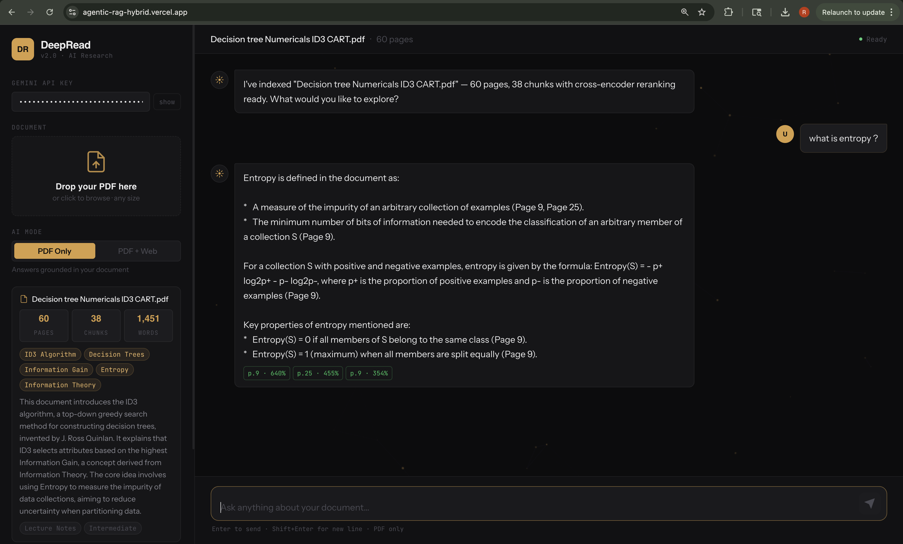

# DeepRead — Agentic RAG System

Upload any PDF. Ask anything. Get answers with exact page citations.

Live Demo: https://agentic-rag-hybrid.vercel.app

## Demo
[Watch Demo Video](https://github.com/Rehanku/Agentic-RAG-hybrid/blob/main/deepread.mov)

## What is this?
DeepRead is a full-stack Agentic RAG system that lets you upload PDF documents and query them using semantic search, cross-encoder reranking, and an optional live web search agent powered by Gemini 2.5.

## Architecture
- Frontend: React + Vite, deployed on Vercel
- Backend: FastAPI + LangChain, Dockerized on HuggingFace Spaces
- AI Pipeline: FAISS vector search → Cross-encoder reranking → Gemini 2.5 generation
- Web Agent: DuckDuckGo search for real-time web augmentation

## Tech Stack
| Layer | Technology |
|---|---|
| Frontend | React, Vite, Vanilla CSS, Nginx |
| Backend | Python, FastAPI, LangChain |
| AI/ML | FAISS, Sentence Transformers, Cross-Encoder, Gemini 2.5 |
| Infrastructure | Docker, HuggingFace Spaces, Vercel |

## Local Development
1. Copy environment variables:
cp .env.example .env

2. Start the stack:
make up

3. Access:
Frontend: http://localhost:3000
Backend: http://localhost:8000

## Author
Rehan Khan — AIML Student
[LinkedIn] | [GitHub]
